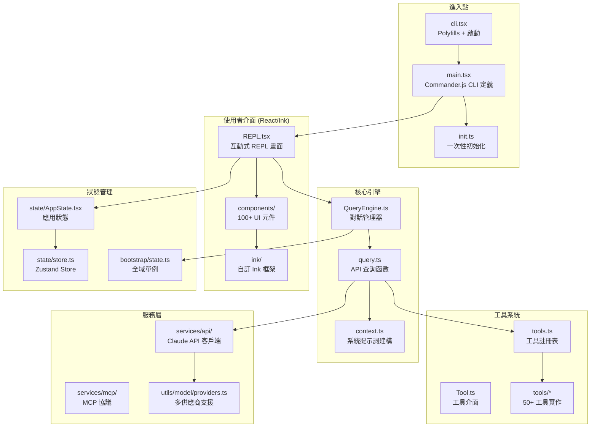
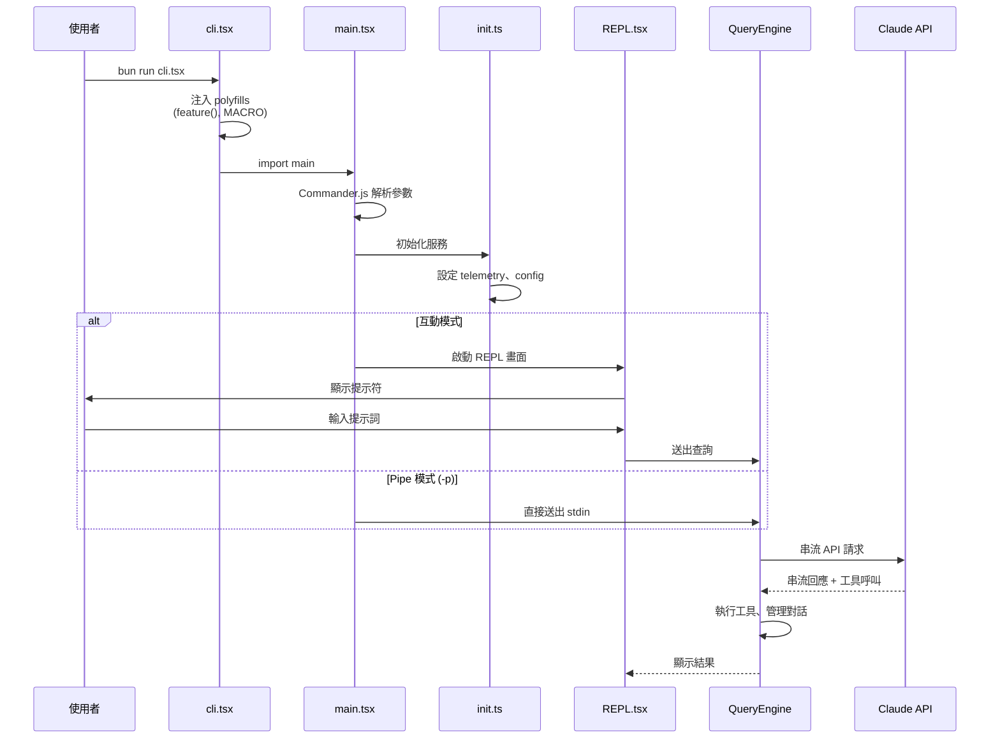

# 01 - 專案總覽

## 這是什麼？

這是 Anthropic 官方 **Claude Code CLI** 工具的反編譯（decompiled）版本。Claude Code 是一個終端機 AI 助手，讓開發者可以在命令列中與 Claude 互動，執行程式碼編輯、檔案操作、Git 操作等任務。

## 技術棧

| 項目 | 技術 |
|------|------|
| **Runtime** | Bun（非 Node.js） |
| **語言** | TypeScript + TSX |
| **UI 框架** | React + Ink（終端 UI） |
| **CLI 框架** | Commander.js |
| **API SDK** | @anthropic-ai/sdk |
| **模組系統** | ESM（`"type": "module"`） |
| **構建** | Bun 單檔打包 |
| **Monorepo** | Bun workspaces（`packages/`） |

## 目錄結構總覽

```
claude-code-can-run/
├── src/                    # 主要原始碼
│   ├── entrypoints/        # 程式進入點
│   ├── main.tsx            # CLI 定義（Commander.js）
│   ├── query.ts            # 核心 API 查詢函數
│   ├── QueryEngine.ts      # 查詢引擎（對話管理）
│   ├── context.ts          # 系統提示詞建構
│   ├── tools.ts            # 工具註冊表
│   ├── Tool.ts             # 工具介面定義
│   ├── tools/              # 所有工具實作（50+）
│   ├── screens/            # 畫面（REPL、Doctor）
│   ├── components/         # React/Ink UI 元件（100+）
│   ├── ink/                # 自訂 Ink 框架（forked）
│   ├── ink.ts              # Ink 渲染包裝器
│   ├── state/              # 狀態管理（Zustand-style）
│   ├── bootstrap/          # 啟動時全域狀態
│   ├── services/           # 服務層（API、MCP、分析）
│   ├── hooks/              # React hooks
│   ├── utils/              # 工具函數（300+）
│   ├── types/              # TypeScript 型別定義
│   ├── commands/           # CLI 子命令
│   ├── skills/             # 技能系統
│   └── ...                 # 其他模組
├── packages/               # Monorepo 內部套件
│   ├── @ant/               # Computer Use 存根
│   ├── color-diff-napi/    # 顏色差異（完整實作）
│   └── *-napi/             # 原生模組存根
├── package.json
├── tsconfig.json
├── bunfig.toml
└── CLAUDE.md               # AI 開發指引
```

## 架構圖



## 啟動流程



## 重要注意事項

1. **~1341 個 tsc 錯誤** — 來自反編譯，不影響 Bun 運行時執行
2. **`feature()` 永遠回傳 `false`** — 所有功能旗標後的程式碼都是死碼
3. **React Compiler 輸出** — 元件中有 `_c()` 記憶化樣板，這是正常的
4. **多個模組已被刪除/存根化** — Voice、MagicDocs、Plugins 等功能已移除
