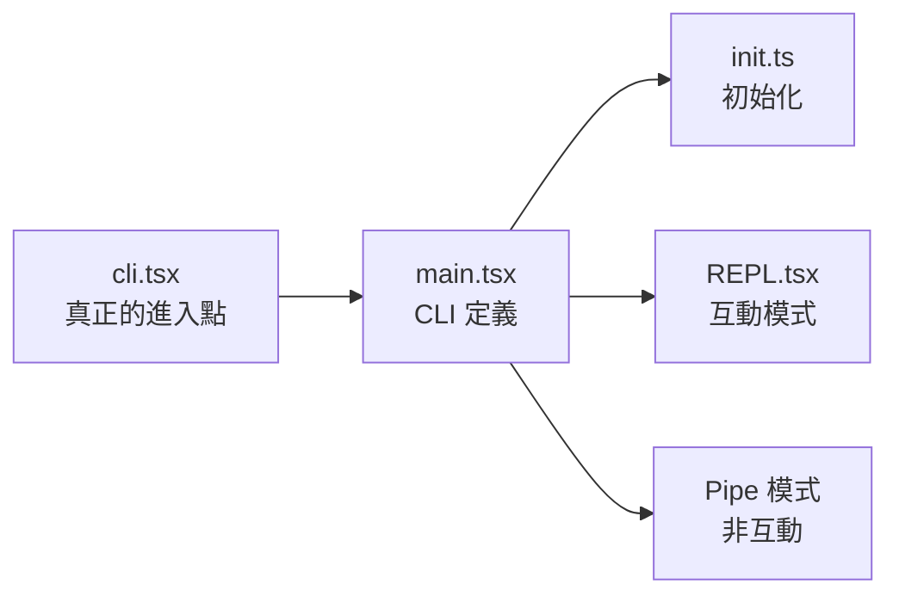
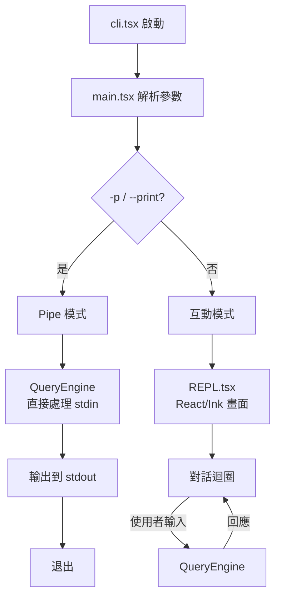

# 02 - 進入點與啟動流程

## 進入點層級



## `src/entrypoints/cli.tsx` — 真正的進入點

這是 `bun run` 執行的第一個檔案。主要責任：

### 1. Runtime Polyfills

```typescript
// feature() 永遠回傳 false — 關閉所有功能旗標
globalThis.feature = () => false;

// 模擬構建時 macro 注入
globalThis.MACRO = {
  VERSION: "...",
  BUILD_TIME: "...",
  // ...
};

// 全域常量
globalThis.BUILD_TARGET = "bun";
globalThis.BUILD_ENV = "production";
globalThis.INTERFACE_TYPE = "cli";
```

### 2. 為什麼需要 Polyfills？

原始 Claude Code 使用 Bun 的 `bun:bundle` API 在**構建時**注入這些值。反編譯版本無法使用構建時 API，所以在運行時模擬。

## `src/main.tsx` — CLI 定義

使用 **Commander.js** 定義所有 CLI 選項和子命令：

```
claude [options] [prompt]           # 主命令
claude auth                         # 認證管理
claude doctor                       # 健康檢查
claude mcp                          # MCP 伺服器管理
claude install                      # 安裝原生版本
claude update                       # 更新檢查
```

### 關鍵選項

| 選項 | 說明 |
|------|------|
| `-p, --print` | Pipe 模式（非互動，輸出後退出） |
| `-c, --continue` | 繼續最近的對話 |
| `-r, --resume` | 恢復指定對話 |
| `--model <model>` | 指定模型（sonnet, opus 等） |
| `--dangerously-skip-permissions` | 跳過權限檢查（沙箱用） |
| `--system-prompt` | 自訂系統提示詞 |
| `--mcp-config` | MCP 伺服器設定 |

### 啟動服務初始化

`main.tsx` 在啟動時初始化：
- **認證服務** — API key / OAuth 驗證
- **分析服務** — Telemetry（已存根化）
- **策略服務** — 使用政策檢查
- **MCP 連線** — Model Context Protocol 伺服器

## `src/entrypoints/init.ts` — 一次性初始化

在首次啟動時執行：
- Telemetry 設定
- 設定檔載入
- 工作區信任對話框

## `src/bootstrap/state.ts` — 全域狀態單例

存放整個 session 生命週期的全域狀態：

```typescript
// 模組層級單例（非 React state）
sessionId         // 當前 session UUID
cwd               // 當前工作目錄
projectRoot       // 專案根目錄
tokenCounts       // Token 使用統計
```

## 兩種執行模式



### Pipe 模式 (`-p`)
```bash
echo "explain this code" | bun run cli.tsx -p
cat file.py | bun run cli.tsx -p "review this"
```
- 讀取 stdin，發送到 API，輸出回應，退出
- 適合腳本和管道操作

### 互動模式（預設）
- 啟動 React/Ink REPL 介面
- 支援多輪對話、工具呼叫、權限提示
- 完整的終端 UI 體驗
