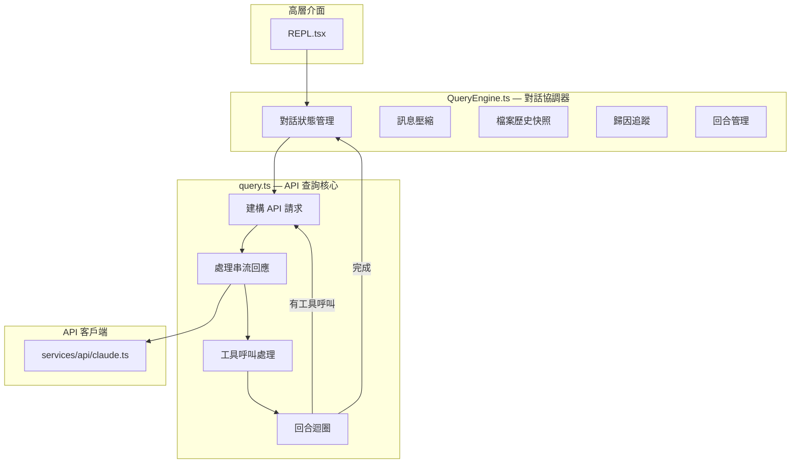
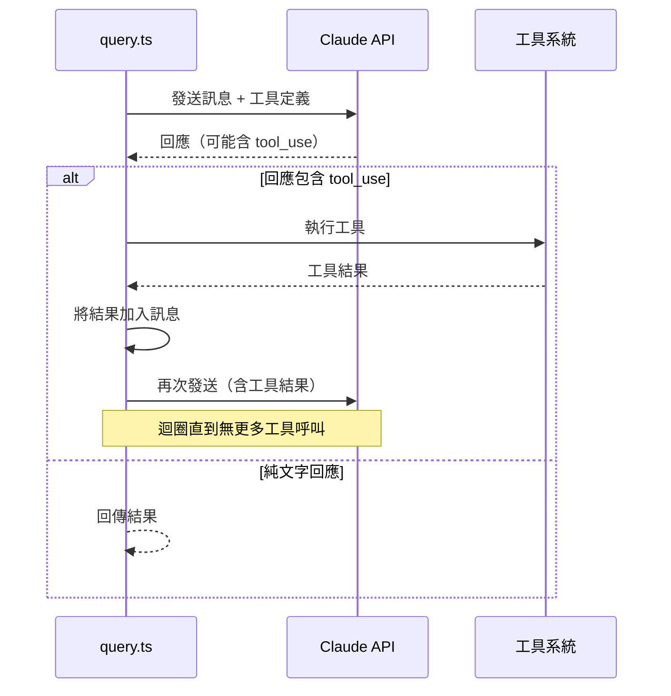
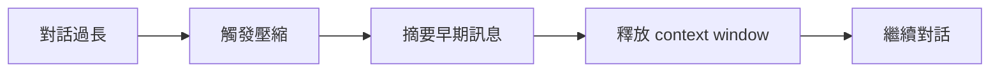
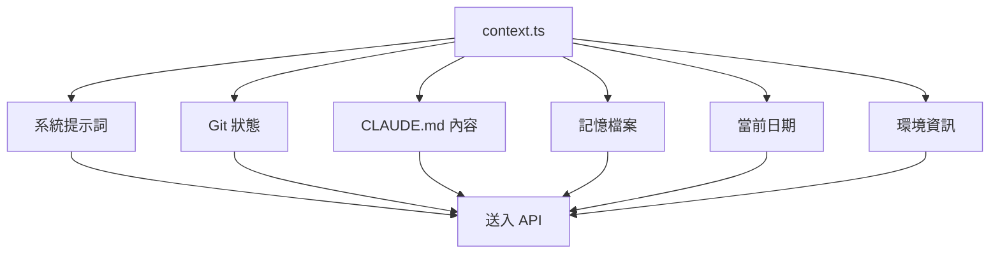

# 03 - 核心引擎（Query & QueryEngine）

## 架構概覽

## `src/query.ts` — 核心查詢函數

這是整個系統最核心的函數。負責：

### 1. 建構 API 請求
- 組裝系統提示詞（`context.ts`）
- 附加對話訊息歷史
- 註冊可用工具列表
- 設定模型參數（temperature、max_tokens 等）

### 2. 串流 API 回應
- 使用 Anthropic SDK 的串流端點
- 處理 `BetaRawMessageStreamEvent` 事件
- 即時顯示回應文字

### 3. 工具呼叫迴圈（Agentic Loop）

這個「Agentic Loop」是 Claude Code 能自主完成複雜任務的關鍵 — AI 可以反覆呼叫工具、觀察結果、決定下一步。

## `src/QueryEngine.ts` — 對話管理器

比 `query.ts` 更高層的協調器，包裝了 `query()` 並管理：

### 對話狀態
- 維護完整的訊息歷史
- 追蹤 token 使用量
- 管理對話壓縮（context window 接近上限時）

### 訊息壓縮（Compaction）

當對話接近模型的 context window 上限時，QueryEngine 會自動壓縮（summarize）早期訊息，保留最近的上下文。

### 檔案歷史快照
- 在工具修改檔案前記錄快照
- 支援回溯和差異比較

### 歸因追蹤（Attribution）
- 追蹤 AI 修改了哪些檔案
- 用於 Git commit 歸因

### 回合管理（Turn Bookkeeping）
- 每個「回合」= 使用者輸入 → AI 回應（含所有工具呼叫）
- 統計每回合的 token、成本、時間

## `src/context.ts` — 系統提示詞建構

為每次 API 呼叫建構完整的上下文：

### CLAUDE.md 發現機制（`utils/claudemd.ts`）

從專案層級結構中發現並載入 CLAUDE.md 檔案：
1. 專案根目錄的 `CLAUDE.md`
2. 使用者家目錄的 `~/.claude/CLAUDE.md`
3. 子目錄中的 `CLAUDE.md`

這些檔案提供專案特定的 AI 指引。
