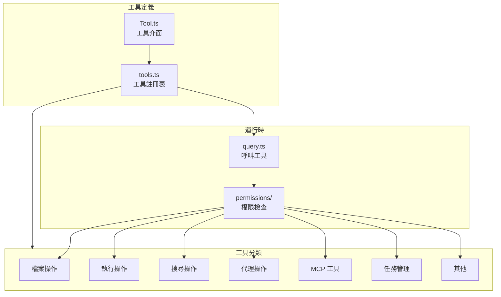
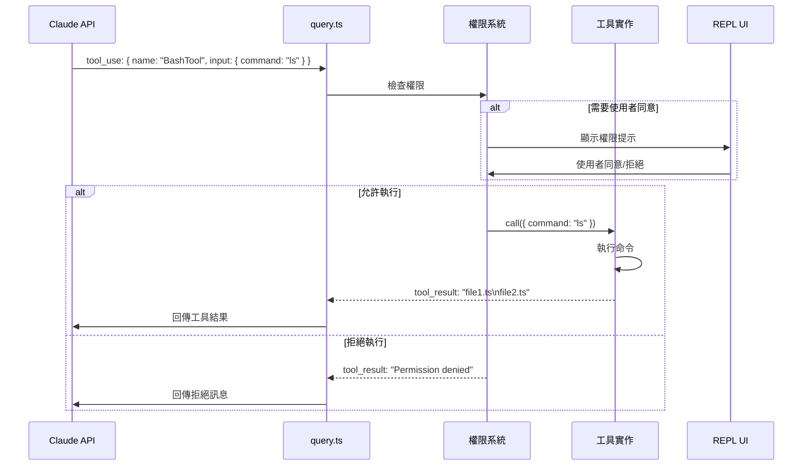

# 04 - 工具系統（Tool System）

## 概覽

工具系統是 Claude Code 的核心能力來源。Claude 透過工具來讀寫檔案、執行命令、搜尋程式碼等。



## `src/Tool.ts` — 工具介面

每個工具必須實作以下介面：

```typescript
interface Tool {
  name: string;                    // 工具名稱
  description: string;             // 工具描述（給 AI 看）
  inputSchema: JSONSchema;         // 輸入參數的 JSON Schema
  call(input): Promise<Result>;    // 執行函數
  // 可選：
  component?: React.Component;     // 結果渲染元件
  isEnabled?(): boolean;           // 是否啟用
}
```

## `src/tools.ts` — 工具註冊表

組裝所有可用工具的列表，部分工具根據條件載入：
- `feature()` 旗標（目前全部 `false`）
- `process.env.USER_TYPE`
- 使用者權限設定

## 工具完整清單

### 檔案操作工具

| 工具 | 目錄 | 說明 |
|------|------|------|
| **FileReadTool** | `tools/FileReadTool/` | 讀取檔案內容（支援圖片、PDF、Notebook） |
| **FileWriteTool** | `tools/FileWriteTool/` | 建立或完整覆寫檔案 |
| **FileEditTool** | `tools/FileEditTool/` | 精確字串替換編輯（diff 方式） |
| **NotebookEditTool** | `tools/NotebookEditTool/` | 編輯 Jupyter Notebook |

### 搜尋工具

| 工具 | 目錄 | 說明 |
|------|------|------|
| **GlobTool** | `tools/GlobTool/` | 檔案名稱模式匹配搜尋 |
| **GrepTool** | `tools/GrepTool/` | 檔案內容正則搜尋（基於 ripgrep） |

### 執行工具

| 工具 | 目錄 | 說明 |
|------|------|------|
| **BashTool** | `tools/BashTool/` | 執行 Bash 命令 |
| **PowerShellTool** | `tools/PowerShellTool/` | 執行 PowerShell 命令（Windows） |
| **REPLTool** | `tools/REPLTool/` | 執行 REPL 程式碼 |

### 代理與溝通工具

| 工具 | 目錄 | 說明 |
|------|------|------|
| **AgentTool** | `tools/AgentTool/` | 啟動子代理處理複雜任務 |
| **SendMessageTool** | `tools/SendMessageTool/` | 向子代理發送訊息 |
| **AskUserQuestionTool** | `tools/AskUserQuestionTool/` | 向使用者提問 |

### MCP（Model Context Protocol）工具

| 工具 | 目錄 | 說明 |
|------|------|------|
| **MCPTool** | `tools/MCPTool/` | 呼叫 MCP 伺服器提供的工具 |
| **McpAuthTool** | `tools/McpAuthTool/` | MCP OAuth 認證 |
| **ListMcpResourcesTool** | `tools/ListMcpResourcesTool/` | 列出 MCP 資源 |
| **ReadMcpResourceTool** | `tools/ReadMcpResourceTool/` | 讀取 MCP 資源 |

### Web 工具

| 工具 | 目錄 | 說明 |
|------|------|------|
| **WebFetchTool** | `tools/WebFetchTool/` | 抓取網頁內容 |
| **WebSearchTool** | `tools/WebSearchTool/` | 網頁搜尋 |
| **WebBrowserTool** | `tools/WebBrowserTool/` | 瀏覽器操作 |

### 任務管理工具

| 工具 | 目錄 | 說明 |
|------|------|------|
| **TaskCreateTool** | `tools/TaskCreateTool/` | 建立背景任務 |
| **TaskGetTool** | `tools/TaskGetTool/` | 取得任務狀態 |
| **TaskListTool** | `tools/TaskListTool/` | 列出任務 |
| **TaskUpdateTool** | `tools/TaskUpdateTool/` | 更新任務 |
| **TaskOutputTool** | `tools/TaskOutputTool/` | 取得任務輸出 |
| **TaskStopTool** | `tools/TaskStopTool/` | 停止任務 |
| **TodoWriteTool** | `tools/TodoWriteTool/` | 待辦事項管理 |

### 模式與流程工具

| 工具 | 目錄 | 說明 |
|------|------|------|
| **EnterPlanModeTool** | `tools/EnterPlanModeTool/` | 進入計畫模式 |
| **ExitPlanModeTool** | `tools/ExitPlanModeTool/` | 退出計畫模式 |
| **EnterWorktreeTool** | `tools/EnterWorktreeTool/` | 進入 Git worktree |
| **ExitWorktreeTool** | `tools/ExitWorktreeTool/` | 退出 Git worktree |
| **VerifyPlanExecutionTool** | `tools/VerifyPlanExecutionTool/` | 驗證計畫執行 |

### 其他工具

| 工具 | 目錄 | 說明 |
|------|------|------|
| **ToolSearchTool** | `tools/ToolSearchTool/` | 搜尋可用工具 |
| **SkillTool** | `tools/SkillTool/` | 執行技能（slash commands） |
| **ConfigTool** | `tools/ConfigTool/` | 設定管理 |
| **BriefTool** | `tools/BriefTool/` | 簡報工具 |
| **DiscoverSkillsTool** | `tools/DiscoverSkillsTool/` | 發現可用技能 |
| **SleepTool** | `tools/SleepTool/` | 等待指定時間 |
| **MonitorTool** | `tools/MonitorTool/` | 監控工具 |
| **SnipTool** | `tools/SnipTool/` | 片段工具 |
| **ReviewArtifactTool** | `tools/ReviewArtifactTool/` | 審查產出物 |
| **ScheduleCronTool** | `tools/ScheduleCronTool/` | 排程 Cron 任務 |
| **RemoteTriggerTool** | `tools/RemoteTriggerTool/` | 遠端觸發 |
| **SendUserFileTool** | `tools/SendUserFileTool/` | 發送檔案給使用者 |
| **TerminalCaptureTool** | `tools/TerminalCaptureTool/` | 終端截圖 |
| **LSPTool** | `tools/LSPTool/` | Language Server Protocol |
| **WorkflowTool** | `tools/WorkflowTool/` | 工作流程 |

## 工具呼叫流程



## 共用工具程式碼

- **`tools/shared/`** — 工具間共用的輔助函數
- **`tools/utils.ts`** — 工具相關的通用工具函數
- **`tools/src/`** — 工具模組內部的原始碼

## 權限系統

工具執行前必須通過權限檢查（`src/components/permissions/`）：

| 權限模式 | 說明 |
|----------|------|
| `default` | 每次工具呼叫都詢問使用者 |
| `acceptEdits` | 自動允許檔案編輯 |
| `dontAsk` | 不詢問（但仍有安全限制） |
| `bypassPermissions` | 跳過所有檢查（僅限沙箱） |
| `plan` | 計畫模式（只讀） |
