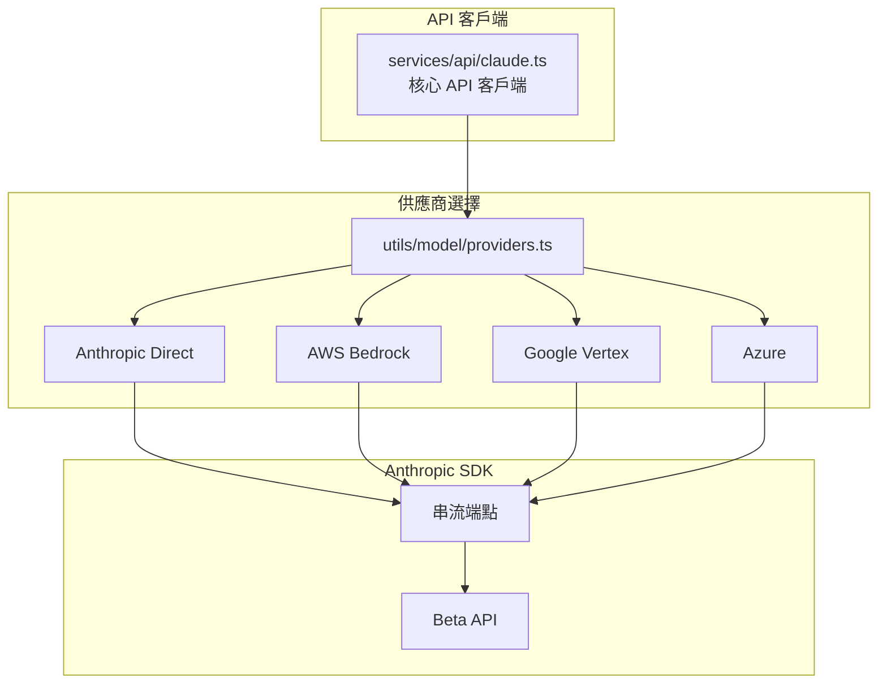
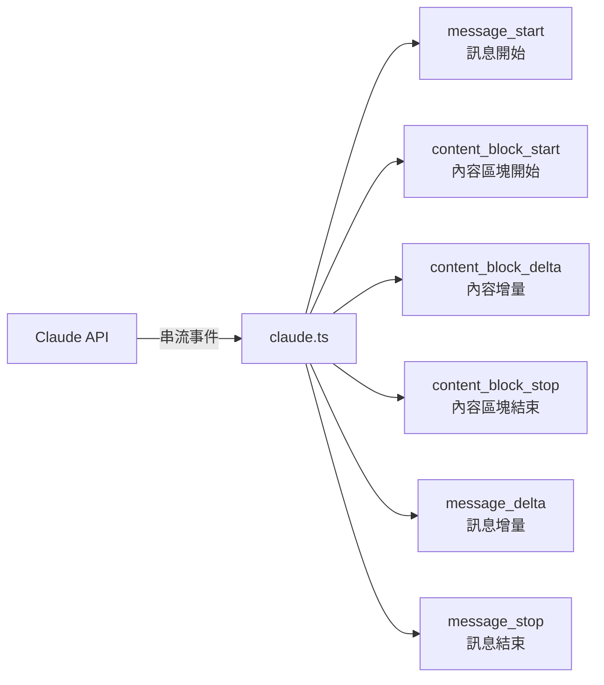
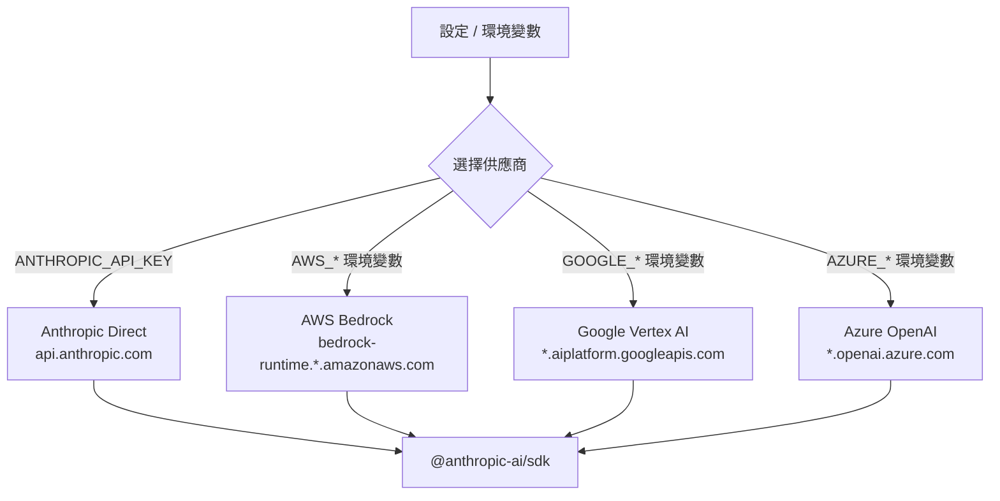
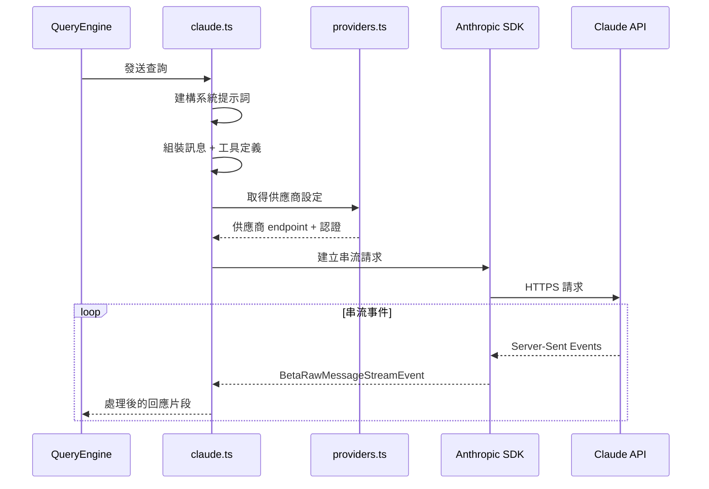

# 05 - API 層與多供應商支援

## 架構概覽



## `src/services/api/claude.ts` — 核心 API 客戶端

這是與 Claude API 通訊的核心模組，負責：

### 1. 建構請求參數
- **系統提示詞** — 從 `context.ts` 取得
- **訊息歷史** — 對話上下文
- **工具定義** — 可用工具的 JSON Schema
- **Beta 標頭** — 啟用實驗性功能

### 2. 串流處理
使用 Anthropic SDK 的串流端點，處理事件類型：



### 3. 事件類型

| 事件 | 說明 |
|------|------|
| `message_start` | 新訊息開始，包含模型資訊 |
| `content_block_start` | 新的內容區塊（文字或工具呼叫） |
| `content_block_delta` | 區塊內容的增量更新（串流文字） |
| `content_block_stop` | 區塊結束 |
| `message_delta` | 訊息層級的更新（stop_reason 等） |
| `message_stop` | 整個訊息完成 |

## `src/utils/model/providers.ts` — 多供應商支援

根據設定選擇不同的 API 供應商：



### 供應商認證方式

| 供應商 | 認證方式 |
|--------|----------|
| **Anthropic** | `ANTHROPIC_API_KEY` 環境變數 |
| **AWS Bedrock** | AWS credentials（IAM、STS） |
| **Google Vertex** | Google Cloud credentials |
| **Azure** | Azure AD / API key |

## 相關服務模組

### `src/services/` 目錄結構

```
services/
├── api/
│   └── claude.ts           # 核心 API 客戶端
├── analytics/              # 分析服務（已存根化）
├── compact/                # 訊息壓縮服務
├── mcp/                    # MCP 協議服務
├── oauth/                  # OAuth 認證
├── lsp/                    # Language Server Protocol
├── tools/                  # 工具相關服務
├── SessionMemory/          # 對話記憶
├── PromptSuggestion/       # 提示建議
└── ...
```

### Token 估算（`services/tokenEstimation.ts`）
- 估算訊息的 token 數量
- 用於判斷是否需要壓縮對話

### MCP 服務（`services/mcp/`）
- Model Context Protocol 客戶端實作
- 連接外部 MCP 伺服器
- 動態載入外部工具

## API 請求流程


