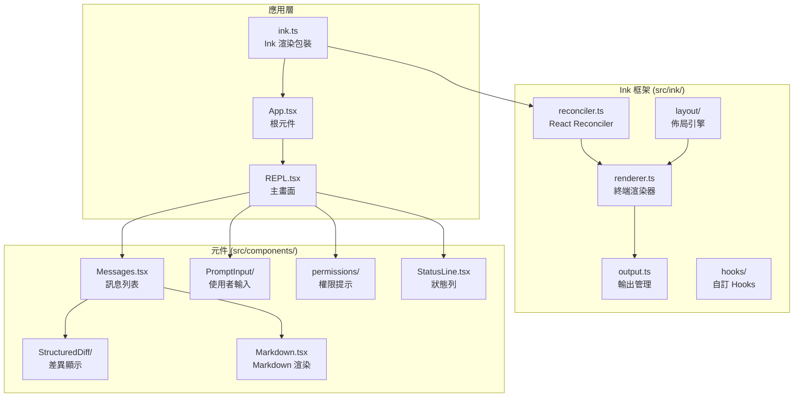
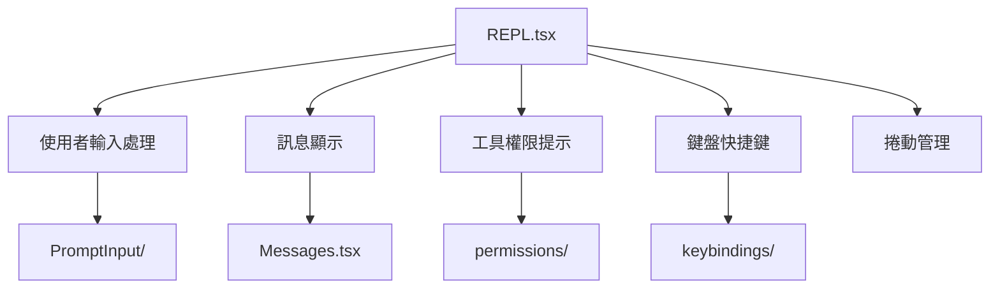
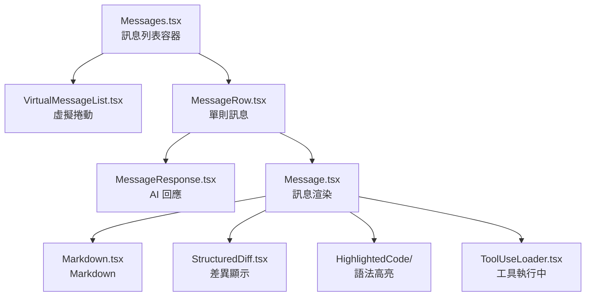

# 06 - UI 層（React / Ink 終端介面）

## 架構概覽

Claude Code 使用 **React + Ink** 在終端中渲染互動式 UI。Ink 是一個將 React 元件渲染為終端文字的框架。



## `src/ink.ts` — Ink 渲染包裝器

進入 Ink 世界的橋樑：
- 初始化 Ink 渲染器
- 注入 ThemeProvider
- 管理終端 I/O

## `src/ink/` — 自訂 Ink 框架

這是一個 **forked/內部版本** 的 Ink 框架，包含自訂優化：

| 檔案 | 說明 |
|------|------|
| `reconciler.ts` | React Reconciler — 將 React 虛擬 DOM 對應到終端輸出 |
| `renderer.ts` | 終端渲染引擎 |
| `output.ts` | 管理終端輸出緩衝 |
| `dom.ts` | 自訂 DOM 節點 |
| `layout/` | Yoga-based 佈局引擎（flexbox） |
| `hooks/` | 自訂 React hooks（`useInput`, `useTerminalSize` 等） |
| `screen.ts` | 螢幕管理 |
| `cursor.ts` | 游標控制 |
| `frame.ts` | 影格渲染 |
| `selection.ts` | 文字選取 |
| `searchHighlight.ts` | 搜尋高亮 |
| `Ansi.tsx` | ANSI 轉義碼元件 |
| `bidi.ts` | 雙向文字支援 |
| `colorize.ts` | 終端顏色處理 |
| `termio/` | 底層終端 I/O |

## 主要畫面

### `src/screens/REPL.tsx` — 互動 REPL

主要的對話介面，負責：



### 其他畫面

| 畫面 | 說明 |
|------|------|
| `Doctor.tsx` | 健康檢查畫面 |
| `ResumeConversation.tsx` | 恢復對話畫面 |

## 核心 UI 元件

### 訊息系統



### 使用者輸入（`components/PromptInput/`）

```
PromptInput/
├── PromptInput.tsx        # 主輸入元件
├── TextInput integration  # 文字輸入
├── 自動完成               # Tab 補全
└── 歷史瀏覽               # 上下鍵
```

### 權限系統 UI（`components/permissions/`）

當工具需要權限時顯示互動式提示：
- 顯示工具名稱和參數
- 允許/拒絕/永久允許選項
- 不同權限模式的處理

### 其他重要元件

| 元件 | 說明 |
|------|------|
| `StatusLine.tsx` | 底部狀態列（模型、token 數等） |
| `Spinner.tsx` / `Spinner/` | 載入動畫 |
| `FileEditToolDiff.tsx` | 檔案編輯差異顯示 |
| `FilePathLink.tsx` | 可點擊的檔案路徑 |
| `Markdown.tsx` | 終端 Markdown 渲染 |
| `MarkdownTable.tsx` | Markdown 表格渲染 |
| `ModelPicker.tsx` | 模型選擇器 |
| `Onboarding.tsx` | 新手引導 |
| `TrustDialog/` | 工作區信任對話框 |
| `GlobalSearchDialog.tsx` | 全域搜尋 |
| `HistorySearchDialog.tsx` | 歷史搜尋 |
| `Settings/` | 設定介面 |
| `ExportDialog.tsx` | 對話匯出 |

## React Compiler 輸出

反編譯的元件包含 React Compiler 的記憶化樣板程式碼：

```typescript
// 這是正常的 — React Compiler 自動產生的優化程式碼
const $ = _c(15);  // 分配 15 個記憶化插槽
if ($[0] !== props.value) {
  // 只在 props.value 改變時重新計算
  $[0] = props.value;
  $[1] = expensiveComputation(props.value);
}
```

## Hooks 系統（`src/hooks/`）

提供大量自訂 React hooks：

| Hook | 說明 |
|------|------|
| `useTerminalSize` | 追蹤終端尺寸變化 |
| `useTextInput` | 文字輸入管理 |
| `useVimInput` | Vim 風格輸入 |
| `useVirtualScroll` | 虛擬捲動 |
| `useExitOnCtrlCD` | Ctrl+C/D 退出處理 |
| `useElapsedTime` | 經過時間追蹤 |
| `useDiffData` | 差異資料處理 |
| `useHistorySearch` | 歷史搜尋 |
| `useSettings` | 設定存取 |
| `useVoice` | 語音輸入（已存根） |
| `useIDEIntegration` | IDE 整合 |
| `usePrStatus` | PR 狀態追蹤 |
