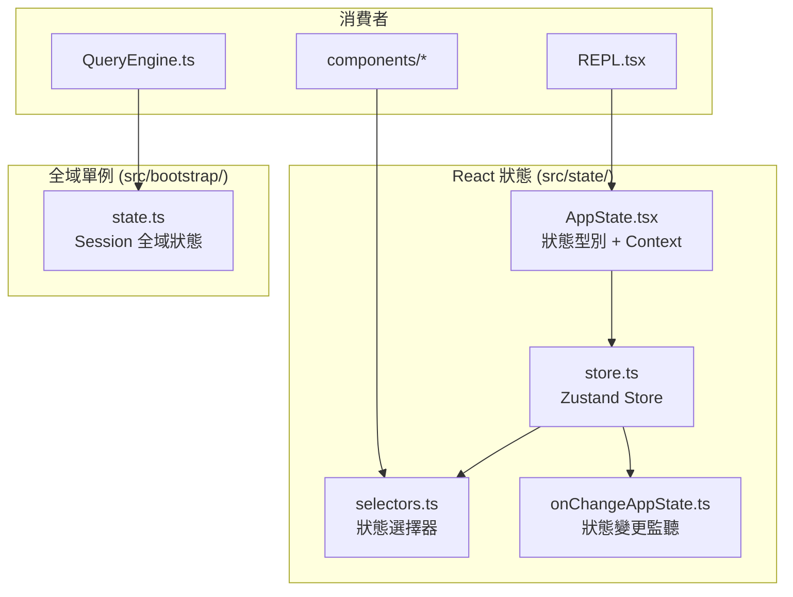
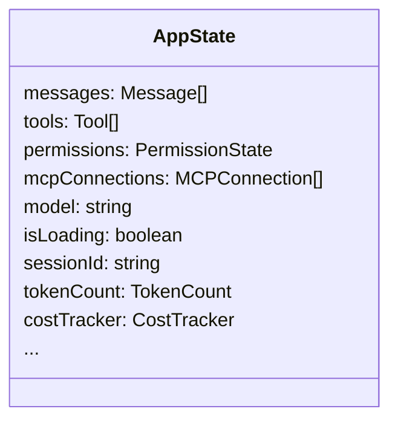
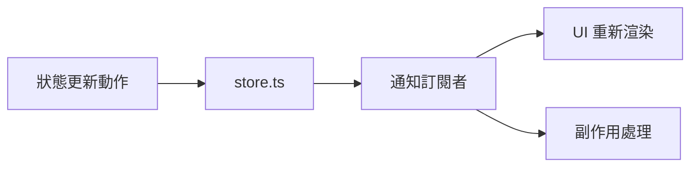
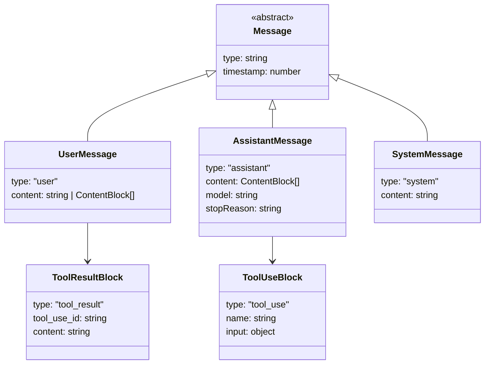
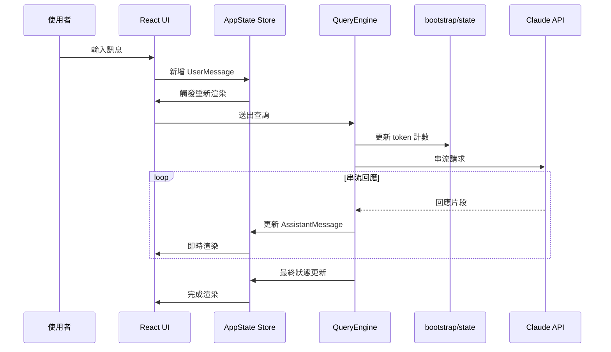
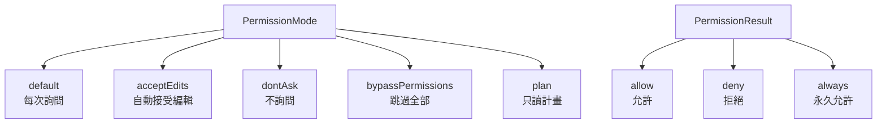

# 07 - 狀態管理

## 架構概覽

Claude Code 有兩種狀態管理機制：**React 狀態**（Zustand-style store）和**模組層級單例**。



## `src/state/AppState.tsx` — 應用狀態

定義中央應用狀態的型別和 React Context Provider：



### 主要狀態欄位

| 欄位 | 說明 |
|------|------|
| `messages` | 完整對話訊息歷史 |
| `tools` | 當前可用工具列表 |
| `permissions` | 權限狀態（已批准的工具等） |
| `mcpConnections` | MCP 伺服器連線 |
| `model` | 當前使用的模型 |
| `isLoading` | 是否正在等待 API 回應 |
| `sessionId` | 當前 session ID |
| `tokenCount` | Token 使用統計 |

## `src/state/store.ts` — Zustand-style Store

使用類似 Zustand 的 store 模式管理狀態：



## `src/state/selectors.ts` — 狀態選擇器

提供從狀態中衍生資料的選擇器函數，避免不必要的重新渲染。

## `src/state/onChangeAppState.ts` — 狀態變更監聽

監聽特定狀態變更並觸發副作用。

## `src/bootstrap/state.ts` — 模組層級單例

用於不需要 React 響應性的全域狀態：

```typescript
// 這些是簡單的模組層級變數
export let sessionId: string;       // 當前 session UUID
export let cwd: string;             // 當前工作目錄
export let projectRoot: string;     // 專案根目錄
export let tokenCounts: {...};      // Token 使用統計
```

### 為什麼有兩種狀態？

| | React Store | 模組單例 |
|--|-------------|----------|
| **用途** | UI 渲染相關 | 非 UI 全域資料 |
| **響應性** | 自動觸發重新渲染 | 無響應性 |
| **存取方式** | React Context / hooks | 直接 import |
| **使用場景** | 元件、畫面 | QueryEngine、API 層 |

## 訊息型別系統（`src/types/message.ts`）



## 狀態資料流



## 權限型別（`src/types/permissions.ts`）


