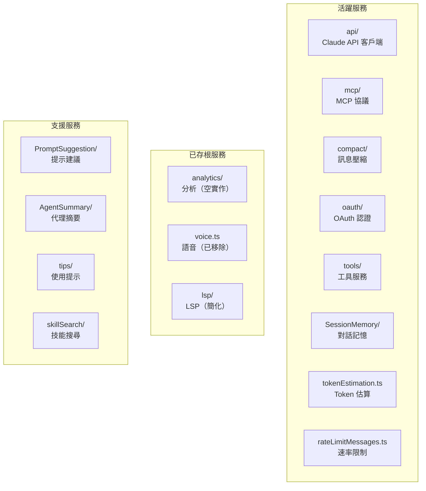
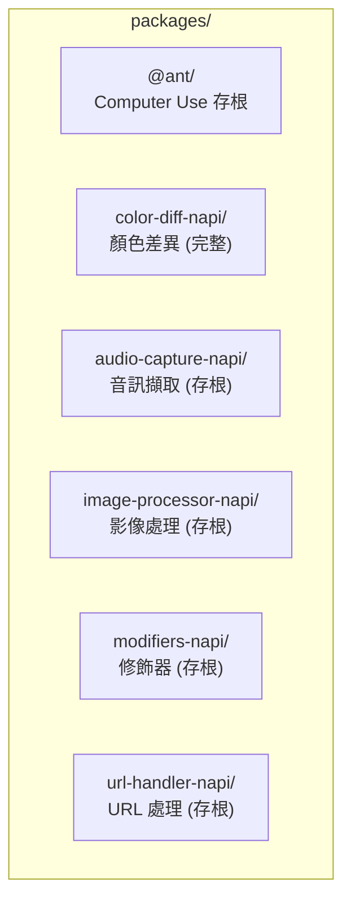
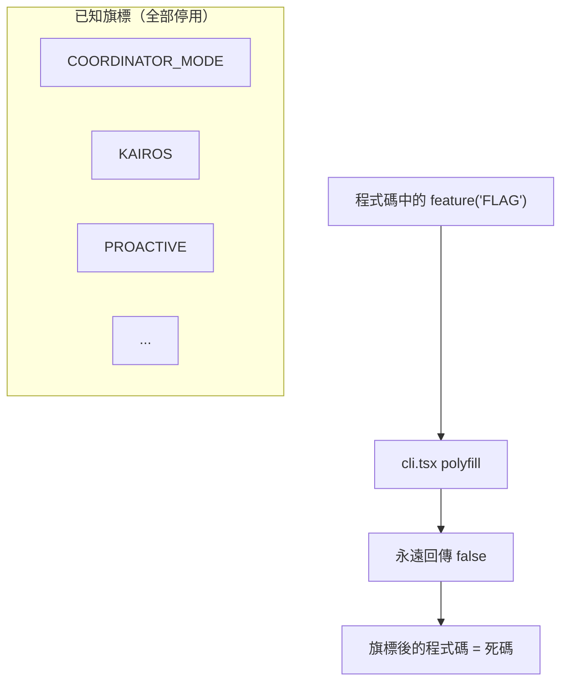

# 08 - 服務與模組說明

## 服務層總覽（`src/services/`）

### 核心服務詳解

| 服務 | 路徑 | 說明 |
|------|------|------|
| **API** | `services/api/` | Claude API 客戶端，串流通訊核心 |
| **MCP** | `services/mcp/` | Model Context Protocol 客戶端，連接外部工具伺服器 |
| **Compact** | `services/compact/` | 對話壓縮，當 context window 接近上限時摘要早期訊息 |
| **OAuth** | `services/oauth/` | OAuth 2.0 認證流程（簡化版） |
| **Tools** | `services/tools/` | 工具相關的服務邏輯 |
| **Session Memory** | `services/SessionMemory/` | 跨 session 的記憶管理 |
| **Token Estimation** | `services/tokenEstimation.ts` | 訊息 token 數量估算 |

## 工具函數庫（`src/utils/`）

超過 300 個工具函數，按功能分類：

### 核心工具

| 模組 | 說明 |
|------|------|
| `model/` | 模型選擇、供應商、成本計算 |
| `permissions/` | 權限驗證邏輯 |
| `settings/` | 設定檔讀寫 |
| `claudemd.ts` | CLAUDE.md 發現與載入 |
| `config.ts` | 設定管理 |
| `auth.ts` | 認證相關 |
| `tokens.ts` | Token 計算 |

### 檔案與 Git

| 模組 | 說明 |
|------|------|
| `git.ts` / `git/` | Git 操作（diff、status、branch 等） |
| `file.ts` | 檔案操作工具 |
| `fileHistory.ts` | 檔案歷史追蹤 |
| `diff.ts` | 差異計算 |
| `glob.ts` | Glob 模式匹配 |
| `ripgrep.ts` | ripgrep 搜尋封裝 |
| `worktree.ts` | Git worktree 管理 |

### Shell 與執行

| 模組 | 說明 |
|------|------|
| `Shell.ts` | Shell 管理 |
| `ShellCommand.ts` | Shell 命令封裝 |
| `bash/` | Bash 相關工具 |
| `shell/` | Shell 設定 |
| `process.ts` | 進程管理 |

### UI 相關

| 模組 | 說明 |
|------|------|
| `theme.ts` | 主題管理 |
| `markdown.ts` | Markdown 處理 |
| `format.ts` | 格式化工具 |
| `terminal.ts` | 終端工具 |
| `hyperlink.ts` | 終端超連結 |

### 網路與 HTTP

| 模組 | 說明 |
|------|------|
| `http.ts` | HTTP 工具 |
| `proxy.ts` | 代理設定 |
| `caCerts.ts` | CA 憑證管理 |

### 其他重要模組

| 模組 | 說明 |
|------|------|
| `mcp/` | MCP 相關工具函數 |
| `hooks.ts` / `hooks/` | 生命周期 Hook 系統 |
| `skills/` | 技能系統工具 |
| `plugins/` | 插件系統工具 |
| `todo/` | Todo 管理 |
| `memory/` | 記憶系統 |
| `sandbox/` | 沙箱安全 |
| `telemetry/` | 遙測（已存根） |
| `debug.ts` | 除錯工具 |
| `errors.ts` | 錯誤處理 |

## 套件（`packages/`）

| 套件 | 狀態 | 說明 |
|------|------|------|
| `@ant/*` | 存根 | Anthropic 內部 Computer Use 套件 |
| `color-diff-napi` | **完整** | 顏色差異比較（原生模組） |
| `audio-capture-napi` | 存根 | 音訊擷取（語音功能已移除） |
| `image-processor-napi` | 存根 | 影像處理 |
| `modifiers-napi` | 存根 | 修飾器 |
| `url-handler-napi` | 存根 | URL 處理 |

## 技能系統（`src/skills/`）

技能是可透過 `/command` 觸發的預定義動作：

## 特性旗標系統

所有 `feature()` 呼叫來自 `bun:bundle`（構建時 API）。在反編譯版本中，polyfill 讓它永遠回傳 `false`，等於停用所有 Anthropic 內部功能。

## 已移除/存根化的功能

| 功能 | 狀態 | 說明 |
|------|------|------|
| Computer Use | 存根套件 | `@ant/*` 空實作 |
| Voice Mode | 已移除 | 語音輸入/輸出 |
| Magic Docs | 已移除 | 文件魔法功能 |
| LSP Server | 已移除 | Language Server |
| Plugins Marketplace | 已移除 | 插件市場 |
| Analytics / GrowthBook | 空實作 | A/B 測試、分析 |
| Sentry | 空實作 | 錯誤追蹤 |
| MCP OAuth | 簡化 | OAuth 流程簡化版 |
