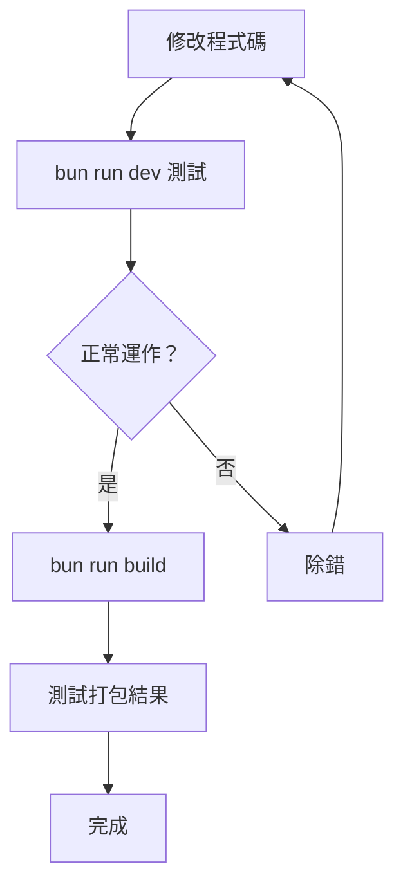

# 09 - 開發指南

## 快速開始

### 環境需求

- **Bun** >= 1.x（Runtime & 套件管理）
- **Node.js** >= 22（備用，npm install 時需要）
- **Git**

### 安裝與執行

```bash
# 安裝依賴
bun install
# 如果 bun install 有 symlink 問題，改用：
npm install --legacy-peer-deps

# 開發模式執行
bun run dev
# 等同於：
bun run src/entrypoints/cli.tsx

# Pipe 模式（非互動）
echo "say hello" | bun run src/entrypoints/cli.tsx -p

# 構建（產出 dist/cli.js，約 25MB）
bun run build

# 查看幫助
bun run src/entrypoints/cli.tsx --help
```

### 環境變數

```bash
# 必要：API 認證（選一）
export ANTHROPIC_API_KEY="sk-ant-..."      # Anthropic Direct
export AWS_ACCESS_KEY_ID="..."             # AWS Bedrock
export GOOGLE_APPLICATION_CREDENTIALS="..."# Google Vertex

# 可選：除錯
export CLAUDE_CODE_DEBUG=1
```

## 開發工作流程



## 專案慣例

### 1. 不要嘗試修復所有 tsc 錯誤

```bash
# 這會顯示 ~1341 個錯誤 — 這是正常的
npx tsc --noEmit
```

這些錯誤來自反編譯，不影響 Bun 運行時。只修復你正在修改的程式碼的型別。

### 2. `feature()` 永遠是 `false`

```typescript
// 這個區塊永遠不會執行
if (feature('SOME_FLAG')) {
  // 死碼 — 不需要維護
}
```

### 3. React Compiler 樣板

```typescript
// 這種程式碼是正常的，不要修改
const $ = _c(10);
if ($[0] !== dep) {
  $[0] = dep;
  $[1] = computedValue;
}
```

### 4. 路徑別名

```typescript
// tsconfig 設定了 src/* 路徑別名
import { something } from 'src/utils/file';
// 等同於
import { something } from './src/utils/file';
```

### 5. `bun:bundle` import

```typescript
// 在 main.tsx 等檔案中
import { feature } from 'bun:bundle';
// 構建時由 Bun 提供，開發時由 cli.tsx 的 polyfill 提供
```

## 關鍵修改點指南

### 想要修改 CLI 選項？
→ `src/main.tsx`（Commander.js 定義）

### 想要新增工具？
→ 在 `src/tools/` 建立新目錄，實作 `Tool` 介面，在 `src/tools.ts` 註冊

### 想要修改系統提示詞？
→ `src/context.ts` 和 `src/utils/systemPrompt.ts`

### 想要修改 UI 元件？
→ `src/components/`（React/Ink 元件）

### 想要修改 API 通訊？
→ `src/services/api/claude.ts`

### 想要修改權限行為？
→ `src/utils/permissions/` 和 `src/components/permissions/`

### 想要修改模型設定？
→ `src/utils/model/`

### 想要修改 MCP 行為？
→ `src/services/mcp/` 和 `src/utils/mcp/`

## 除錯技巧

### 啟用除錯模式

```bash
# 全部除錯日誌
bun run src/entrypoints/cli.tsx -d

# 過濾特定類別
bun run src/entrypoints/cli.tsx -d "api,hooks"

# 寫入檔案
bun run src/entrypoints/cli.tsx --debug-file /tmp/claude-debug.log
```

### 常見問題

| 問題 | 解決方案 |
|------|----------|
| `bun install` symlink 壞掉 | 改用 `npm install --legacy-peer-deps` |
| `Cannot find module` | 確認 `node_modules` 不是壞的 symlink |
| Pipe 模式超時 | 設定 `ANTHROPIC_API_KEY` |
| tsc 報一堆錯誤 | 正常現象，忽略（除非你在修改的檔案） |
| React Compiler 報錯 | 不影響運行，忽略 |

## 專案檔案結構速查

```
src/
├── entrypoints/cli.tsx     ← 啟動入口
├── main.tsx                ← CLI 定義
├── query.ts                ← API 查詢核心
├── QueryEngine.ts          ← 對話管理
├── context.ts              ← 提示詞建構
├── tools.ts                ← 工具註冊
├── Tool.ts                 ← 工具介面
├── tools/                  ← 50+ 工具實作
├── screens/REPL.tsx        ← 互動介面
├── components/             ← 100+ UI 元件
├── ink/                    ← 自訂 Ink 框架
├── state/                  ← 狀態管理
├── services/               ← 服務層
├── hooks/                  ← React hooks
├── utils/                  ← 300+ 工具函數
├── types/                  ← 型別定義
├── skills/                 ← 技能系統
├── commands/               ← CLI 子命令
└── bootstrap/              ← 啟動時狀態
```
