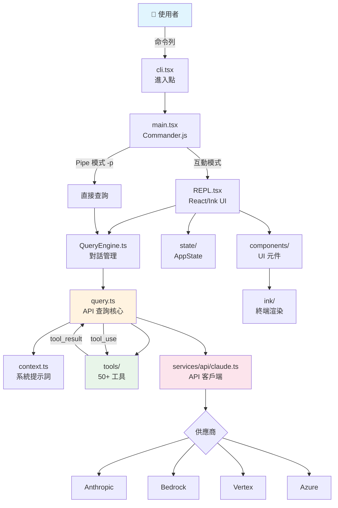

# Level 1 — 專案基本架構分析

> Claude Code CLI 反編譯版本的架構文件，幫助開發者快速理解並上手開發。

## 文件目錄

| # | 文件 | 內容 |
|---|------|------|
| 01 | [專案總覽](01-project-overview.md) | 技術棧、目錄結構、架構圖、啟動流程 |
| 02 | [進入點與啟動](02-entry-and-bootstrap.md) | cli.tsx → main.tsx → init.ts 啟動鏈、兩種執行模式 |
| 03 | [核心引擎](03-core-engine.md) | query.ts、QueryEngine.ts、Agentic Loop、訊息壓縮 |
| 04 | [工具系統](04-tool-system.md) | 50+ 工具完整清單、工具介面、權限系統、呼叫流程 |
| 05 | [API 與供應商](05-api-and-providers.md) | API 客戶端、串流處理、多供應商（Anthropic/Bedrock/Vertex/Azure） |
| 06 | [UI 層](06-ui-layer.md) | React/Ink 框架、REPL 畫面、100+ 元件、Hooks 系統 |
| 07 | [狀態管理](07-state-management.md) | AppState、Zustand Store、全域單例、訊息型別、權限型別 |
| 08 | [服務與模組](08-services-and-modules.md) | 服務層、工具函數庫、套件、技能系統、已移除功能 |
| 09 | [開發指南](09-development-guide.md) | 快速開始、開發工作流、慣例、修改指南、除錯技巧 |

## 全域架構圖

## 建議閱讀順序

1. **[01 專案總覽](01-project-overview.md)** — 先看大圖
2. **[02 進入點](02-entry-and-bootstrap.md)** — 理解程式如何啟動
3. **[09 開發指南](09-development-guide.md)** — 實際跑起來
4. **[03 核心引擎](03-core-engine.md)** — 理解核心邏輯
5. **[04 工具系統](04-tool-system.md)** — 理解 AI 能力來源
6. 其他文件按需閱讀
